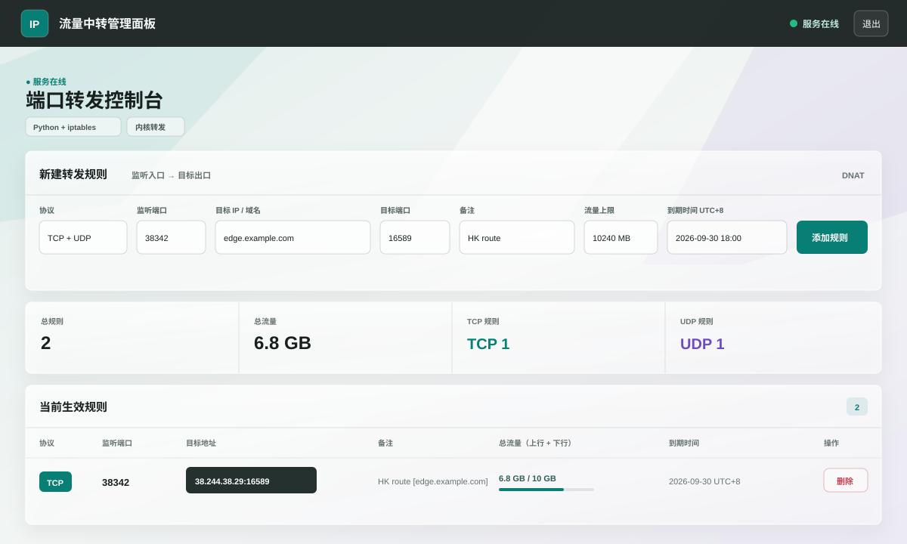

# Iptables / Nftables Traffic Forwarding Panel

[中文](#中文) | [English](#english)

## 中文

一个轻量级 Web 流量中转面板，用来通过网页管理 TCP / UDP 端口转发规则。

稳定版使用 `Python Flask + iptables`。实验版 `install-v2.sh` 支持 `Python/Rust + iptables/nftables` 多种组合。面板默认使用液态玻璃 UI。

### 面板预览



### 核心功能

- Web UI 管理 TCP、UDP、TCP+UDP 端口转发
- 自动开启 IPv4 forwarding
- 自动注册 `systemd` 服务，支持开机自启
- 支持目标 IP 或域名解析
- 支持备注、规则列表、规则删除
- 支持查看每条新转发的已用流量
- 已用流量按 `上行 + 下行总和` 统计
- 支持为每条新转发设置流量上限，到达上限后自动停用
- 支持为每条新转发设置 UTC+8 到期时间，到期后自动停用
- 支持端口范围校验和重复规则保护
- 升级面板时默认保留已有转发规则
- 卸载时可选择保留规则或连同面板可见规则一起删除

### 核心安装脚本

稳定版安装脚本：`install.sh`

推荐大多数用户使用这个版本。它使用 `Python Flask + iptables`，兼容性最好。

```bash
wget -O install.sh https://raw.githubusercontent.com/wcfbxw/iptables-web-panel/main/install.sh && sudo bash install.sh
```

安装时会交互式设置：

- 面板运行端口，默认 `5000`
- 管理员用户名，默认 `admin`
- 管理员密码，默认 `123456`
- UI 风格：液态玻璃版

安装完成后访问：

```text
http://你的服务器IP:面板端口
```

### 实验版安装脚本

实验版安装脚本：`install-v2.sh`

安装时可以选择运行时和防火墙后端：

- `Python + iptables`
- `Python + nftables`
- `Rust + iptables`
- `Rust + nftables`

```bash
wget -O install-v2.sh https://raw.githubusercontent.com/wcfbxw/iptables-web-panel/main/install-v2.sh && sudo bash install-v2.sh
```

实验版同样支持流量统计、流量上限、UTC+8 到期时间和自动停用规则。
实验版同样使用液态玻璃 UI。

说明：

- `iptables` 后端使用 `PREROUTING DNAT + POSTROUTING MASQUERADE`
- `nftables` 后端会创建独立的 `ip iptables_panel` NAT table
- `Python` 版本使用 Flask
- `Rust` 版本使用 Rust 标准库实现轻量 HTTP 面板，不依赖 crates.io 三方包
- 新增规则会带 `iptables-panel` / `iptables-panel-track` comment，便于识别和清理

### 流量统计和限制

添加规则时可以填写“流量上限”，单位为 MB。

- 不填写：不限流量，只显示已用流量
- 填写数字：例如 `10240` 表示约 10 GB

面板显示的已用流量是：

```text
已用流量 = 上行流量 + 下行流量
```

达到流量上限后，后台检测线程会自动删除这条转发规则，使其停止转发。

### 到期时间限制

添加规则时可以填写“到期时间”，时间按 UTC+8 解释。

- 不填写：不过期
- 填写时间：到达该 UTC+8 时间后自动删除这条转发规则

流量上限和到期时间可以同时设置，任一条件先达到都会停用这条转发。

### 日常维护

查看运行状态：

```bash
sudo systemctl status iptables-panel
```

重启面板：

```bash
sudo systemctl restart iptables-panel
```

停止面板：

```bash
sudo systemctl stop iptables-panel
```

启动面板：

```bash
sudo systemctl start iptables-panel
```

查看日志：

```bash
sudo journalctl -u iptables-panel -f
```

### 删除 / 卸载

推荐重新运行稳定版安装脚本，然后选择卸载菜单：

```bash
wget -O install.sh https://raw.githubusercontent.com/wcfbxw/iptables-web-panel/main/install.sh && sudo bash install.sh
```

可选删除方式：

- 选择 `2`：只删除面板程序和服务，保留现有转发规则
- 选择 `3`：删除面板程序和服务，并删除当前面板可见的转发规则

选择 `3` 时，脚本会要求输入：

```text
DELETE
```

只有输入确认后才会删除规则，避免误删。

### 手动卸载但保留规则

```bash
sudo systemctl stop iptables-panel
sudo systemctl disable iptables-panel
sudo rm -f /etc/systemd/system/iptables-panel.service
sudo systemctl daemon-reload
sudo rm -rf /opt/iptables-panel
```

这样不会删除已经写入内核的 iptables / nftables 规则。

### 手动清空 NAT 规则

谨慎使用。下面命令会清空整个 iptables NAT 表，可能影响 Docker 或其他程序创建的 NAT 规则：

```bash
sudo iptables -t nat -F
```

nftables 实验版创建的是独立表，可以删除该表：

```bash
sudo nft delete table ip iptables_panel
```

---

## English

A lightweight web panel for managing TCP / UDP traffic forwarding rules.

The stable installer uses `Python Flask + iptables`. The experimental installer `install-v2.sh` supports multiple combinations of `Python/Rust + iptables/nftables`. The panel uses the Liquid Glass UI by default.

### UI Preview


### Features

- Manage TCP, UDP, and TCP+UDP forwarding rules from a Web UI
- Enable IPv4 forwarding automatically
- Register a `systemd` service with auto-start support
- Support target IP or domain name resolution
- Support remarks, rule listing, and rule deletion
- Show traffic usage for newly added forwarding rules
- Traffic usage is counted as `upload + download total`
- Support per-rule traffic quota; the rule is disabled after reaching the limit
- Support per-rule UTC+8 expiration time; the rule is disabled after expiration
- Validate port range and prevent duplicate rules
- Keep existing forwarding rules by default during upgrade
- During uninstall, choose whether to keep rules or remove panel-visible rules

### Core Installer

Stable installer: `install.sh`

Recommended for most users. It uses `Python Flask + iptables` and has the best compatibility.

```bash
wget -O install.sh https://raw.githubusercontent.com/wcfbxw/iptables-web-panel/main/install.sh && sudo bash install.sh
```

The installer asks for:

- Panel port, default `5000`
- Admin username, default `admin`
- Admin password, default `123456`
- UI style: Liquid Glass

After installation, open:

```text
http://your-server-ip:panel-port
```

### Experimental Installer

Experimental installer: `install-v2.sh`

You can choose the runtime and firewall backend during installation:

- `Python + iptables`
- `Python + nftables`
- `Rust + iptables`
- `Rust + nftables`

```bash
wget -O install-v2.sh https://raw.githubusercontent.com/wcfbxw/iptables-web-panel/main/install-v2.sh && sudo bash install-v2.sh
```

The experimental installer also supports traffic usage, traffic quota, UTC+8 expiration time, and automatic rule disabling.
The experimental installer also uses the Liquid Glass UI.

Notes:

- The `iptables` backend uses `PREROUTING DNAT + POSTROUTING MASQUERADE`
- The `nftables` backend creates an isolated `ip iptables_panel` NAT table
- The `Python` version uses Flask
- The `Rust` version uses only Rust standard library for a lightweight HTTP panel
- New rules are tagged with `iptables-panel` / `iptables-panel-track` comments for easier cleanup

### Traffic Quota

When adding a rule, you can set a traffic limit in MB.

- Empty: unlimited traffic, usage is still displayed
- Number: for example, `10240` means about 10 GB

Displayed traffic usage is:

```text
traffic usage = upload traffic + download traffic
```

After the limit is reached, the background checker automatically deletes the forwarding rule.

### Expiration Time

When adding a rule, you can set an expiration time. The time is interpreted as UTC+8.

- Empty: never expires
- Set a time: the rule is automatically deleted after that UTC+8 time

Traffic quota and expiration time can be used together. Whichever condition is reached first disables the rule.

### Maintenance

Check status:

```bash
sudo systemctl status iptables-panel
```

Restart:

```bash
sudo systemctl restart iptables-panel
```

Stop:

```bash
sudo systemctl stop iptables-panel
```

Start:

```bash
sudo systemctl start iptables-panel
```

View logs:

```bash
sudo journalctl -u iptables-panel -f
```

### Uninstall

Recommended: rerun the stable installer and choose an uninstall option:

```bash
wget -O install.sh https://raw.githubusercontent.com/wcfbxw/iptables-web-panel/main/install.sh && sudo bash install.sh
```

Options:

- Choose `2`: remove panel files and service, keep existing forwarding rules
- Choose `3`: remove panel files and service, and remove panel-visible forwarding rules

Option `3` requires typing:

```text
DELETE
```

This confirmation helps prevent accidental rule deletion.

### Manual Uninstall While Keeping Rules

```bash
sudo systemctl stop iptables-panel
sudo systemctl disable iptables-panel
sudo rm -f /etc/systemd/system/iptables-panel.service
sudo systemctl daemon-reload
sudo rm -rf /opt/iptables-panel
```

This does not delete iptables / nftables rules already written into the kernel.

### Manually Flush NAT Rules

Use with caution. This flushes the whole iptables NAT table and may affect Docker or other programs:

```bash
sudo iptables -t nat -F
```

For nftables experimental installs, the panel uses an isolated table:

```bash
sudo nft delete table ip iptables_panel
```
